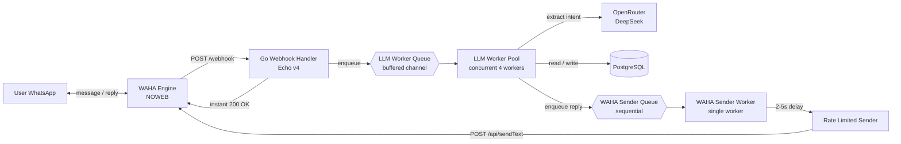
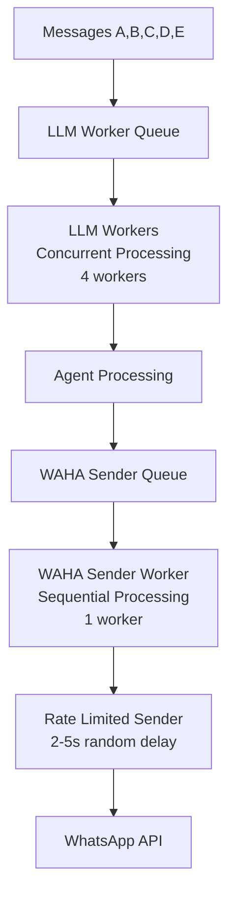
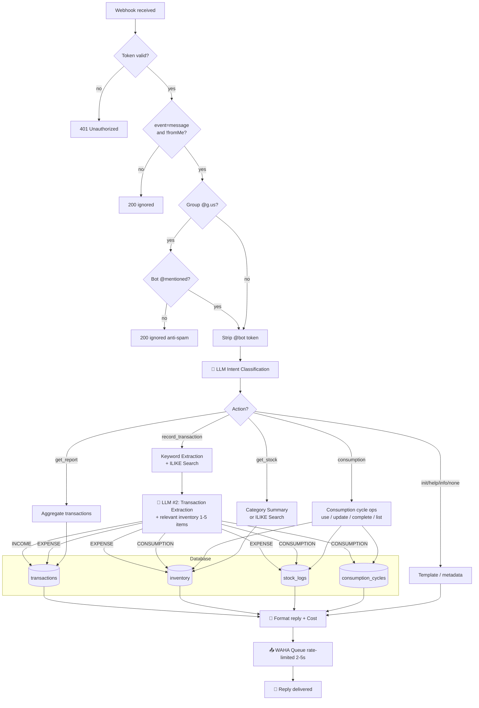
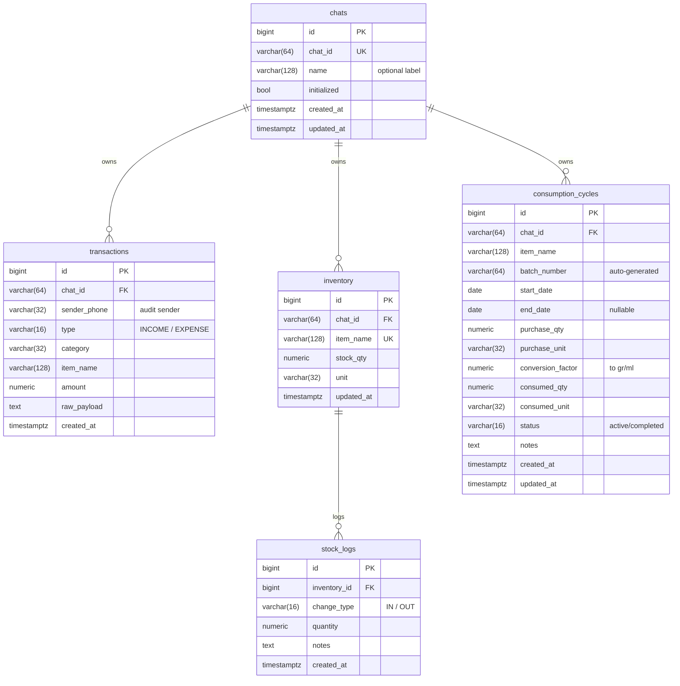

# smart-ledger-agent

A WhatsApp-based assistant for tracking personal expenses and inventory. Just chat naturally — an LLM turns your messages into structured transactions in PostgreSQL.

> Status: Implemented (RFC Rev. C) — see [`RFC/RFC.md`](./RFC/RFC.md) for the full specification.

---

## ✨ Features

- **🤖 LLM-Based Intelligence.** Smart routing via LLM intent classification — handles typos, variations, and natural language automatically. No rigid patterns required.
- **Chat = Ledger.** Each chat (DM or group) is an independent ledger. Groups share one ledger among members; DMs are personal.
- **Natural Language Processing.** Type `beli kopi 15rb`, `cek stock kecap`, atau `analisa konsumsi bulan ini` → LLM understands intent and extracts structured parameters automatically.
- **💰 Real-Time Cost Tracking.** Every WhatsApp reply displays exact LLM cost with transparent breakdown. Monitor spending per operation with microdollar precision.
- **🚀 Token Optimization.** Intelligent search reduces LLM context by 60-90% using PostgreSQL ILIKE pattern matching. Category summaries minimize WhatsApp reply tokens.
- **Automatic Inventory Management.** Physical-goods expenses automatically increase inventory; stock consumption automatically decreases it with smart tracking.
- **Consumption Cycle Tracking.** Track per-item usage from start to finish — auto-generated batch numbers, daily rate calculation in correct units (grams/ml), full consumption history with multi-batch support.
- **Smart Consumption Module.** Advanced consumption tracking with proper unit detection (ml for liquids, gr for solids), batch management, usage completion tracking, and detailed consumption analytics.
- **Financial Tracking.** Income, expenses, opening balance — all automatically categorized with LLM-powered classification.
- **🔍 Smart Search & Categorization.** ILIKE pattern matching finds relevant inventory items (1-5 results). Category summaries provide compact overviews for efficient token usage.
- **Context-Aware.** LLM receives targeted inventory search results to resolve ambiguous item names (`susu` → `susu uht`) with minimal token overhead.
- **Smart Date Handling.** Various date formats supported: "kemarin", "01/08/2026", "01/08", "11-08" — LLM extracts and parses automatically.
- **Group Anti-Spam.** Bot only responds when @-mentioned in groups, preventing unwanted messages.
- **Async Processing.** Webhooks acknowledged in <50ms; LLM processing and database operations run in background with retry logic.

---

## 🏛️ Architecture



### Two-Tier Worker Architecture

The system uses a two-tier worker architecture to optimize performance and prevent WhatsApp bans:



**Tier 1: LLM Workers (Concurrent)**
- 4 parallel workers for fast LLM processing
- Handles intent classification, parameter extraction
- Processes database operations concurrently
- Queues replies for WhatsApp sending

**Tier 2: WAHA Sender (Sequential)**
- Single worker processes messages one-by-one
- Random 2-5 second delays between sends
- Prevents WhatsApp anti-spam detection
- Human-like message timing

### Lifecycle of a Message



### Inventory Context & Search Optimization

Before every LLM extraction, the agent uses intelligent search to find only relevant inventory items and injects them into the system prompt. This allows the LLM to resolve ambiguous item names (e.g., `susu` → `susu uht`) while minimizing token usage.

| Component | Detail |
| :--- | :--- |
| **Search optimization** | ILIKE pattern matching in PostgreSQL (max 5 results) |
| **Keyword extraction** | Removes stopwords/action words, keeps item names |
| **Fallback logic** | General queries → full inventory, specific → search results |
| **Context injection** | Only relevant items (1-5) vs all items (20) before |
| **Token savings** | 60-90% reduction per extraction request |
| **Cache library** | [`patrickmn/go-cache`](https://github.com/patrickmn/go-cache) — in-memory, zero infrastructure |
| **Cache TTL** | 5 minutes with 10-minute cleanup interval |
| **Invalidation** | Write-through — cached entry deleted on every `AddStock` / `DecreaseStock` |

**Search Strategy:**
- Specific queries ("beli kecap") → ILIKE search → 1-2 items (~100 tokens)
- General queries ("barang saya apa aja") → Fallback to all items (~1000 tokens)
- Average savings: ~70% per extraction request

### 🚀 Token Optimization Strategy

The system implements multiple optimization strategies to minimize LLM token usage and operational costs:

#### **1. Database-First Search (LLM Context Optimization)**
Instead of loading entire inventory into every LLM request, the system uses PostgreSQL ILIKE pattern matching:

```go
// Before: Load 20 items → 1000+ tokens
// After: Search 1-5 items → 100-250 tokens
items := invRepo.SearchByName(chatID, "kecap")
```

**Benefits:**
- 60-90% token reduction for specific queries
- Better accuracy (LLM sees only relevant items)
- Scalable to 100+ inventory items

#### **2. Intelligent Keyword Extraction**
The system extracts relevant keywords from user messages, filtering out:
- **Stopwords**: yang, dan, atau, untuk, dengan
- **Action words**: beli, pakai, ambil, transfer
- **Quantity words**: rb, jt, pcs, k

**Example:**
```
"beli kecap 250ml" → ["kecap", "250ml"]
"stok susu uht" → ["susu", "uht"]
"barang saya apa aja" → [] (triggers full inventory)
```

#### **3. Category-Based Summarization (WhatsApp Display Optimization)**
For general stock queries, the system provides category summaries instead of raw item lists:

```go
// Query: "stok"
// Before: List 20 items (~1500 tokens)
// After: Category summary (~200 tokens)

📦 Stok per Kategori:
• MINUMAN: 4 item (contoh: susu uht 500ml)
• SEMBAKO: 4 item (contoh: beras 5kg)
• LAINNYA: 2 item (contoh: tissue)
```

**Benefits:**
- 80-90% token savings for WhatsApp replies
- Better user experience (overview → drill down)
- Handles large inventories gracefully

#### **4. Smart Fallback Logic**
The system automatically detects query patterns and applies optimal strategies:

| Query Pattern | Strategy | Result |
|---------------|----------|--------|
| `"stok kecap"` | ILIKE search → 1-2 items | Specific results |
| `"stok minuman"` | Category search → 4-6 items | Category filtering |
| `"stok"` | Category summary | Compact overview |
| `"barang saya apa aja"` | Full inventory | Complete list |

#### **5. Real-Time Cost Tracking**
Every operation includes transparent cost reporting:

```go
// Every WhatsApp reply includes:
💰 AI cost: $0.000156

// Cost breakdown logged:
- Intent classification: $0.0001
- Extraction (search optimized): $0.000056
- Total: $0.000156
```

### 🤖 LLM-Based Routing Architecture

The system uses LLM as a **translator/adapter** from natural language to structured service API calls.

#### Transaction Types

| Type | Description |
|------|-------------|
| `INCOME` | Money in (salary, bonus, transfer received) |
| `EXPENSE` | Buying goods/services (money out) |
| `CONSUMPTION` | Using stock items, no money involved |
| `NONE` | Not a transaction (greeting, chitchat) |

#### Intent Routing Priority

The intent classifier evaluates messages top-down and stops at the first match:

| Priority | Keyword / Pattern | Action | Examples |
|----------|-------------------|--------|----------|
| 1 | `pakai` / `terpakai` | `consumption` (use / update) | `"pakai susu uht 500ml"`, `"terpakai susu (AUG-12-152714) 100ml"` |
| 2 | `konsumsi` | `consumption` (list / info) | `"konsumsi"`, `"konsumsi susu"`, `"konsumsi list"` |
| 3 | `init` / `help` / `info` | `init` / `help` / `info` | `"init"`, `"bantuan"`, `"info"` |
| 4 | `beli` / `bayar` / money amount | `record_transaction` | `"beli kopi 15rb"`, `"bayar listrik 200rb"` |
| 5 | `stok` / `stock` / `sisa` / `persediaan` | `get_stock` | `"stok kecap"`, `"sisa air"`, `"persediaan"` |
| 6 | `pengeluaran` / `pemasukan` / `laporan` | `get_report` | `"pengeluaran hari ini"`, `"ringkasan kemarin"` |
| 7 | No match | `none` | `"halo"`, `"pagi"`, chitchat |

**Disambiguation examples:**
- `"beli stok kecap 50rb"` → `record_transaction` (not `get_stock`, because `beli` + money wins)
- `"analisa konsumsi susu"` → `consumption` (not `get_report`, because `konsumsi` is higher priority)

#### Implementation Details

**1. Intent Classification Prompt (`SystemPromptIntent`)**
- Classifies user messages into actions: `init`, `help`, `info`, `get_stock`, `get_report`, `consumption`, `record_transaction`, `none`
- Extracts structured parameters (e.g., `item_filter: "kecap"`, `consumption_action: "info"`)
- Handles typo tolerance and natural language variations
- Enhanced consumption query recognition with multiple patterns

**2. Service Handlers (Clean API)**
- `handleInitAction()` - Ledger initialization
- `handleGetStock()` - Stock queries with filtering
- `handleGetReport()` - Financial reports & analysis
- `handleConsumptionAction()` - Consumption cycle management (info, list, use, update, complete)
- `handleRecordTransaction()` - Transaction recording via LLM extraction

**3. Extensibility**
Adding new capabilities only requires:
1. New action type in `SystemPromptIntent`
2. New handler function in `Agent`
3. New case in routing switch statement

Example: Adding `"set_reminder"` action
```go
// Add to SystemPromptIntent
"set_reminder": "Set reminder for specific time/event"

// Add handler
func (a *Agent) handleSetReminder(ctx context.Context, msg entity.IncomingMessage, params map[string]interface{}) error {
    // Extract time and message from params
    // Store in database
    // Reply with confirmation
}

// Add routing
case domain.ActionSetReminder:
    return a.handleSetReminder(ctx, msg, chat, action.Params)
```

---

## 🗃️ Database Schema



Tables are created automatically via GORM `AutoMigrate` on application start. Adding a new struct field → new column is added automatically (existing columns are not dropped).

---

## 🚀 Quick Start

### Prerequisites

- Go 1.25+
- Docker + Docker Compose
- An OpenRouter account (for the API key)
- An active WhatsApp number (this will become the bot)

### 1. Clone & configure env

```bash
git clone https://github.com/skyapps-id/smart-ledger-agent.git
cd smart-ledger-agent
cp .env.example .env
# Edit .env: set WAHA_API_KEY, WAHA_WEBHOOK_TOKEN, OPENROUTER_API_KEY
```

### 2. Start WAHA + PostgreSQL (via docker compose)

```bash
docker compose up -d            # waha + postgres
make db-up                      # alternative: postgres only
```

Scan the WhatsApp QR at `http://localhost:3000/dashboard` (user `admin`, password = `WAHA_DASHBOARD_PASSWORD`).

### 3. Run the app

```bash
make dev                        # go run ./cmd/server
```

Send messages to the bot number:
```
init project bangunan 1
beli semen 5 sak 250rb
ambil semen 2 sak
info
ringkasan
stok kecap
cek sisa susu di rumah          # natural language query
```

---

## ⚙️ Configuration (`.env`)

| Variable | Required | Default | Description |
| :--- | :---: | :--- | :--- |
| `APP_ENV` | – | `development` | runtime env |
| `APP_PORT` | – | `8080` | HTTP server port |
| `DB_DSN` | – | (localhost pg) | PostgreSQL connection string |
| `WAHA_BASE_URL` | – | `http://localhost:3000` | WAHA base URL |
| `WAHA_SESSION` | – | `default` | WAHA session name |
| `WAHA_API_KEY` | ✓ | – | API key for `POST /api/sendText` |
| `WAHA_WEBHOOK_TOKEN` | ✓ | – | webhook validation token |
| `WAHA_DASHBOARD_PASSWORD` | – | `admin` | WAHA dashboard password |
| `OPENROUTER_BASE_URL` | – | `https://openrouter.ai/api/v1` | – |
| `OPENROUTER_API_KEY` | ✓ | – | OpenRouter API key |
| `OPENROUTER_MODEL` | – | `deepseek/deepseek-chat` | LLM model |
| `WORKER_CONCURRENCY` | – | `4` | LLM worker concurrency |
| `WORKER_QUEUE_SIZE` | – | `256` | LLM worker queue size |
| `WORKER_MAX_RETRIES` | – | `3` | max retries for LLM operations |
| `WAHA_SENDER_QUEUE_SIZE` | – | `100` | WAHA sender queue size |
| `WAHA_SENDER_MIN_DELAY_MS` | – | `2000` | Min delay between sends (ms) |
| `WAHA_SENDER_MAX_DELAY_MS` | – | `5000` | Max delay between sends (ms) |

---

## 💬 Commands & Natural Language Queries

### Basic Commands
| Message | Action |
| :--- | :--- |
| `init` | Activate the ledger for this chat |
| `init project bangunan 1` | Activate + name the ledger |
| `info` | Show session metadata (chat_id, sender, status, name, transaction count) |
| `bantuan` | Show the recording-format guide |

### Transaction Recording
```
beli kopi 15rb                              # → EXPENSE: coffee 15k
gaji masuk 10jt                             # → INCOME: salary 10M
beli susu UHT 1 dus isi 50pcs harga 500rb   # → EXPENSE + stock addition
ambil susu 2 pcs                            # → CONSUMPTION: stock decrease
saldo awal 5jt                              # → INCOME: opening balance
```

### Stock Queries (optimized for token efficiency)
```
stok                                        # → Show category summary (hemat tokens)
cek stock kecap                             # → Search specific item (1-5 results)
stok susu                                   # → Search specific item (1-5 results)
sisa air                                    # → Search specific item (1-5 results)
persediaan popok                            # → Search specific item (1-5 results)
stok minuman                                # → Search by category
barang saya apa aja                         # → Show category summary
```

**Token Optimization:**
- General query ("stok") → Category summary (~200 tokens vs ~1500 before)
- Specific query ("stok kecap") → Search results (~100 tokens vs ~1500 before)
- Overall savings: 60-90% per stock query

### Consumption Tracking
```
konsumsi                                    # → Shows all active consumption cycles
konsumsi list                               # → Same as above (explicit)
konsumsi susu uht 500ml                     # → Shows consumption info for specific item
pakai susu uht 500ml                        # → Record usage, start new cycle
pakai susu uht 500ml 05/08                  # → Record usage with custom date (DD/MM or DD/MM/YYYY)
terpakai susu uht 500ml (AUG-12-152714) 100ml  # → Correct consumed amount for a batch
susu uht 500ml sudah habis                  # → Complete consumption cycle with analytics
barang aktif                                # → Lists all items currently being consumed
```

### Financial Reports
```
pengeluaran hari ini berapa                 # → Today's expenses
total pemasukan bulan ini                   # → Income this month
pengeluaran per item kemarin                # → Yesterday's expenses per item
ringkasan kemarin                           # → Yesterday's summary
```

---

## 🧱 Project Structure

```
smart-ledger-agent/
├── cmd/server/                 # entrypoint
├── internal/
│   ├── config/                 # env loader
│   ├── database/               # GORM setup + auto-migrate
│   ├── domain/                 # GORM models + constants (Chat, Transaction, Inventory, StockLog)
│   ├── entity/                 # cross-layer business entities (IncomingMessage)
│   ├── handler/
│   │   ├── model/              # webhook parsing DTOs (WahaPayload)
│   │   ├── webhook.go
│   │   └── health.go
│   ├── llm/                    # OpenRouter client + prompt builder
│   ├── repository/
│   │   ├── model/              # query-result DTOs (TxnSummary, ItemBreakdown, StockMovement)
│   │   ├── chat.go
│   │   ├── consumption_cycle.go  # consumption cycle repository
│   │   ├── transaction.go
│   │   ├── inventory.go
│   │   ├── stock_log.go
│   │   └── report.go
│   ├── router/                 # Echo routes
│   ├── service/                # orchestrator (agent.go, consumption_service.go, report.go, template.go)
│   ├── waha/                   # WhatsApp HTTP client
│   └── worker/                 # async worker pool + retry
├── RFC/RFC.md                  # full specification
├── Dockerfile
├── docker-compose.yml          # postgres + waha + app (optional, via profile)
└── Makefile
```

---

## 🛠️ Development

```bash
make run            # go run ./cmd/server
make build          # build binary to bin/server
make vet            # go vet
make tidy           # go mod tidy
make test           # go test -race -cover
make clean          # remove bin/ and data/

# LLM-specific testing
make test-llm       # test LLM intent classification
make test-flow      # test full flow simulation
```

### Working with LLM Prompts

**Adding New Intent Types:**
1. Edit `internal/llm/prompt.go` - Add new action to `SystemPromptIntent`
2. Edit `internal/domain/models.go` - Add action constant if needed
3. Edit `internal/service/agent.go` - Add handler function
4. Test with `go test -v ./internal/service -run TestYourNewFeature`

**Consumption Module Integration:**
- Automatic unit detection: `determineSmallestUnit()` identifies ml vs gr based on item names
- Multi-batch support: Track multiple consumption cycles for the same item
- Smart completion: `handleConsumptionAction()` with info, list, use, complete actions
- Enhanced LLM prompts: Comprehensive consumption query patterns

**Prompt Best Practices:**
- **Be Specific**: "Extract transaction data" not "Parse the message"
- **JSON Format**: Always request structured JSON output
- **Examples**: Provide 3-5 input → output examples
- **Error Handling**: Define behavior for invalid inputs
- **Context Injection**: Include relevant context (inventory, history)
- **Unit Awareness**: Consider liquid vs solid items when extracting quantities

**Monitoring LLM Performance:**
```bash
# Check LLM response times and accuracy
tail -f logs/app.log | grep "LLM"

# Test specific patterns
go test -v ./internal/service -run TestGetStockQueryPatterns
```

---

## 🐳 Deployment

### Local (WAHA + postgres in containers, app on host)

```bash
docker compose up -d            # postgres + waha
make dev                        # app on host (hot reload friendly)
```

### Full container (postgres + waha + app)

```bash
docker compose --profile app up -d --build
```

The `app` profile uses `DB_DSN=host=postgres ...` to connect to the postgres container. WAHA's webhook is configured to `host.docker.internal:8080` (routes to a host-side app) — adjust `WHATSAPP_HOOK_URL` for production when everything runs inside Docker.

### Production Considerations

**LLM API Management:**
- **Rate Limiting**: Configure `WORKER_MAX_RETRIES` for LLM API failures
- **Cost Monitoring**: Track OpenRouter usage and costs
- **Fallback Strategy**: Consider fallback models for high-availability
- **Response Time**: Target < 2s for intent classification, < 5s for transaction extraction

**Environment Variables for Production:**
```env
APP_ENV=production
WORKER_CONCURRENCY=8          # Scale based on load
WORKER_QUEUE_SIZE=1024         # Larger queue for production
WORKER_MAX_RETRIES=5           # More retries for production stability
```

**Monitoring & Logging:**
```bash
# Monitor LLM performance
tail -f logs/app.log | grep -E "LLM|intent|classification"

# Check worker pool performance
tail -f logs/app.log | grep -E "worker|queue|retry"
```

---

## 🧰 Tech Stack

| Component | Choice |
| :--- | :--- |
| Language | Go 1.25 |
| HTTP Framework | Echo v4 |
| ORM | GORM |
| Database | PostgreSQL 16 |
| WhatsApp Engine | WAHA (NOWEB) |
| LLM Provider | OpenRouter |
| LLM Model | DeepSeek Chat (default) |
| Intent Classification | Custom LLM-based routing |
| Consumption Tracking | Auto-generated batch numbers, smart unit detection (ml/gr) |
| Cache | `patrickmn/go-cache` (in-memory) |
| Container | Docker + Docker Compose |
| Logging | `log/slog` (stdlib) |
| Testing | Go testing + Mock objects |

### LLM Configuration

The system supports both **DeepSeek API direct** and **OpenRouter** as LLM providers:

```env
# Option 1: DeepSeek API direct (recommended — more stable, cheaper, built-in context caching)
LLM_BASE_URL=https://api.deepseek.com
LLM_API_KEY=your_deepseek_api_key
LLM_MODEL=deepseek-chat

# Option 2: Via OpenRouter (fallback)
LLM_BASE_URL=https://openrouter.ai/api/v1
LLM_API_KEY=your_openrouter_api_key
LLM_MODEL=deepseek/deepseek-chat
```

**DeepSeek API direct advantages:**
- Context caching **enabled by default** (disk-based, persists hours to days)
- No rate limit issues from intermediary (OpenRouter)
- Cache hit tokens reported in `usage.prompt_cache_hit_tokens`
- Lower latency (direct connection)

**Free models via OpenRouter:**

> **Free models list:** [openrouter.ai/models?max_price=0](https://openrouter.ai/models?max_price=0&order=most-popular&output_modalities=text)

| Model | Params | Context | Best For |
|-------|--------|---------|----------|
| `google/gemma-4-31b-it:free` | 31B | 262K | **Best free option** - large model, good JSON consistency |
| `openai/gpt-oss-20b:free` | 20B | 131K | OpenAI open-source, reliable JSON output |
| `nvidia/nemotron-3.5-lightning:free` | - | 1M | Fast, huge context window |
| `liquid/lfm-2.5-2.6b:free` | 2.6B | 128K | Lightweight, fastest |

**To switch models:**
```bash
# DeepSeek direct (recommended)
LLM_BASE_URL=https://api.deepseek.com
LLM_API_KEY=your_key
LLM_MODEL=deepseek-chat

# Restart app
make dev
```

**Note:** `session_id` is automatically sent only when using OpenRouter (for sticky routing / prompt caching). DeepSeek API has context caching enabled by default — no configuration needed.

---

## 💰 Cost Tracking & Monitoring

Every LLM request includes real-time cost tracking and transparent reporting:

### Cost Display
```
💰 AI cost: $0.000156
```
This appears at the bottom of every WhatsApp reply, showing the total cost for that specific request.

### Cost Calculation
Cost is calculated based on DeepSeek pricing:
- **Input tokens**: $0.14 per million
- **Cache hits**: $0.014 per million (90% discount)
- **Output tokens**: $0.28 per million

### Cost Breakdown per Request Type
| Request Type | Components | Avg Cost |
|--------------|------------|----------|
| **Intent only** (help, info) | Intent classification | $0.0001-0.0002 |
| **Transaction** (beli, transfer) | Intent + Extraction | $0.00015-0.00025 |
| **Stock query** (general) | Intent + Category summary | $0.00014-0.00024 |
| **Stock query** (specific) | Intent + Search results | $0.00012-0.00022 |

### Usage Tracking
The system tracks detailed token usage:
- `prompt_tokens`: Total input tokens
- `completion_tokens`: Output tokens  
- `prompt_cache_hit_tokens`: Cached tokens (DeepSeek KV cache)
- `total_tokens`: Combined total
- `cost_usd`: Calculated cost in USD

### Token Savings Through Optimization
With search optimization and category summarization:

| Optimization | Before | After | Savings |
|--------------|--------|-------|---------|
| **LLM Context** (specific queries) | ~1500-2000 tokens | ~200-500 tokens | **60-70%** |
| **WhatsApp Display** (general queries) | ~1500-2000 tokens | ~200-300 tokens | **80-90%** |
| **Overall Average** | ~1500 tokens | ~450 tokens | **~70%** |

### Cache Effectiveness
DeepSeek's KV cache provides automatic cost savings:
- **Cache hit rate**: ~85%+ for repeated system prompts
- **Cost discount**: 90% on cached tokens
- **No configuration needed**: Works automatically

---

## 📚 Documentation

- **[`RFC/RFC.md`](./RFC/RFC.md)** — full architecture specification (Rev. C), including business rules, LLM JSON contract, and non-functional requirements.
- **[`REFACTORING.md`](./REFACTORING.md)** — detailed documentation of the LLM-based routing architecture refactoring.

---

## 🤖 LLM Architecture FAQ

**Q: How does the system handle typos?**
A: The LLM intent classifier is trained to handle common typos and variations. Examples like `"persedian kecap"` (typo for "persediaan") are correctly classified.

**Q: Can I add custom query patterns?**
A: Yes! Simply update the `SystemPromptIntent` in `internal/llm/prompt.go` to include your new patterns. No code changes needed.

**Q: What happens if the LLM API is down?**
A: The system has built-in retry logic with exponential backoff. Configure `WORKER_MAX_RETRIES` and monitor logs for LLM errors.

**Q: How accurate is the intent classification?**
A: The system handles common typos and variations via LLM classification. Examples like `"persedian kecap"` (typo for "persediaan") are correctly classified. Accuracy depends on the LLM model used — see model recommendations above.

**Q: Can I switch to a different LLM model?**
A: Yes! Update `OPENROUTER_MODEL` in your `.env` file. The prompts are designed to work with various instruction-following models.

**Q: How do I monitor LLM performance?**
A: Check logs for "LLM", "intent", "classification" keywords, or run specific tests:
```bash
go test -v ./internal/service -run TestGetStockQueryPatterns
```

**Q: How does the consumption module handle different units?**
A: The system automatically detects units based on item names and packaging. "susu uht 200ml" uses milliliters, while "susu 400gr" uses grams. The `determineSmallestUnit()` function intelligently categorizes items.

**Q: Can I track multiple consumption cycles for the same item?**
A: Yes! The system supports multi-batch tracking with auto-generated batch numbers (e.g., "AUG-12-135918"). Each batch is tracked independently with its own consumption analytics.

---

## 📊 Performance Benchmarks

Based on local testing with DeepSeek Chat model:

| Operation | Average Time | Avg Tokens | Cost | Notes |
|-----------|--------------|------------|------|-------|
| Intent Classification | ~300ms | ~500 | $0.0001 | Single API call |
| Transaction Extraction (optimized) | ~500ms | ~200-500 | $0.00005-0.0001 | With search optimization |
| Stock Query (general) | ~600ms | ~200 | $0.00004 | Category summary |
| Stock Query (specific) | ~400ms | ~100 | $0.00002 | Search results |
| End-to-End Response | <2s | ~700-1200 | $0.00015-0.00025 | User query → reply |

**Token Optimization Results:**
- **LLM Context**: 60-70% savings (search vs full inventory)
- **WhatsApp Display**: 80-90% savings (category summary vs full list)
- **Overall**: ~70% average token reduction per request

**System Capacity** (with default settings):
- **Concurrency**: 4 workers (configurable)
- **Queue Size**: 256 messages (configurable)
- **Max Throughput**: ~120 messages/minute
- **Retry Logic**: 3 attempts with exponential backoff
- **Cost Tracking**: Real-time cost display in every reply

**Cost Transparency:**
Every WhatsApp reply includes real-time AI cost:
```
💰 AI cost: $0.000156
```
Cost breakdown includes intent classification + extraction (if applicable).

---

## 🚀 Future Enhancements

Potential improvements to the LLM-based architecture and consumption module:

1. **Advanced Consumption Analytics**: Predictive consumption patterns, smart restocking suggestions, usage trends analysis
2. **Multi-Language Support**: Add prompts for Indonesian, English, other languages
3. **Consumption Reminders**: "Based on your usage, consider buying X in bulk" or "Running low on Y, reorder soon"
4. **Batch Comparison**: Compare consumption rates across different purchase batches
5. **Voice Input**: Integration with speech-to-text for voice messages
6. **Image Recognition**: Parse receipts/invoices via image input for automatic transaction recording
7. **Consumption Goals**: Set daily/weekly consumption targets and track progress
8. **Smart Shopping Lists**: Generate shopping lists based on consumption patterns and current stock

All these would require only prompt additions and minor code changes thanks to the modular architecture!

---

## ⚠️ Notes

- **AutoMigrate** only adds new tables/columns — it does not drop or rename. For breaking schema changes (drop/rename), run SQL manually against postgres.
- **Group mention required.** The bot ignores group messages that don't @-mention it (anti-spam). The `@<bot_jid>` token is automatically stripped from the body before processing.
- **Privacy.** The sender's phone number (`sender_phone`) is recorded for audit; restrict its exposure in monitoring logs.
- **LLM Rate Limits.** OpenRouter has rate limits; configure `WORKER_MAX_RETRIES` appropriately for your usage pattern.
- **Prompt Updates.** Changes to `SystemPromptIntent` or `SystemPrompt` affect all subsequent classifications. Test thoroughly before deploying.
- **Model Dependencies.** The system is designed to work with various LLM models, but prompt effectiveness may vary. Test with your chosen model.

---
