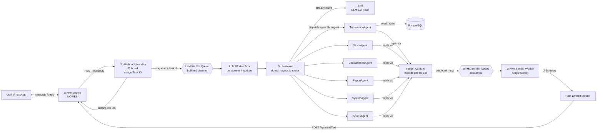
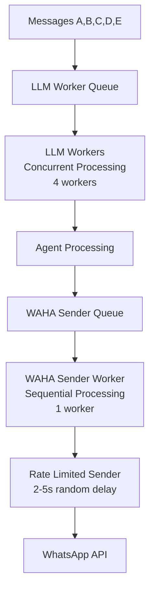

# smart-ledger-agent

A WhatsApp-based assistant for tracking personal expenses and inventory. Just chat naturally — an LLM turns your messages into structured transactions in PostgreSQL.

> Status: Implemented (RFC Rev. C) — see [`RFC/RFC.md`](./RFC/RFC.md) for the full specification.

---

## ✨ Features

- **🤖 LLM-Based Intelligence.** Smart routing via LLM intent classification — handles typos, variations, and natural language automatically. No rigid patterns required.
- **Chat = Ledger.** Each chat (DM or group) is an independent ledger. Groups share one ledger among members; DMs are personal.
- **Natural Language Processing.** Type `beli kopi 15rb`, `cek stock kecap`, atau `analisa konsumsi bulan ini` → LLM understands intent and extracts structured parameters automatically.
- **📦 Goods Master (master-first).** Every item lives in a per-chat `goods` catalog — the single source of names, canonical units (uom), categories, and conversion factors. Transactions/inventory/consumption resolve by `goods_id`; unknown items are rejected with registration guidance (no auto-create, no hallucinated names).
- **⚖️ UOM from master, never from the LLM.** Conversion is defined once (`set 1 galon 15lt`) and applied everywhere: stock units, consumption cycles (stored verbatim — 15 lt, not 15000 ml), and usage conversion (`pakai 3lt` → 0.2 galon). No factor registered? The item simply lives in its stock unit (galon → galon, factor 1).
- **🏷️ Canonical categories.** Category is fixed on the master row — LLM classification can never drift it. `tambah barang` without a category gets a keyword-based suggestion (correctable via `set kategori`).
- **💰 Real-Time Cost Tracking.** Every WhatsApp reply displays exact LLM cost. Two LLM hops max (intent + extraction), constant prompt size — no per-message catalog injection.
- **Automatic Inventory Management.** Physical-goods expenses increase stock in the master's unit; consumption decreases it via master factors with batch tracking and daily-rate analytics.
- **Consumption Cycle Tracking.** Per-batch usage from start to finish — auto-generated batch numbers, multi-batch support, history and rate in the master's conversion unit.
- **Financial Tracking.** Income, expenses, opening balance — category comes from the master (keyword-suggested at `tambah barang`, correctable anytime via `set kategori`).
- **🔍 DB-side name resolution.** Ambiguous names (`susu` → uht/bmt) resolved by exact → LIKE → original-message filter, with numbered confirmation when needed — zero extra prompt tokens.
- **✅ Deterministic Writes.** LLM only routes intents and extracts text verbatim; every DB write is owned by deterministic code.
- **Smart Date Handling.** Various date formats supported: "kemarin", "01/08/2026", "01/08", "11-08" — LLM extracts and parses automatically, with today's date injected at runtime ([KONTEKS WAKTU]) so relative dates and short dates are never hallucinated.
- **🧭 End-to-End Task Tracing.** Every message gets a Task ID at the webhook (`X-Task-ID` response header) that correlates all logs across handler → worker → orchestrator → sub-agents → reply, with per-step cost/duration and a one-line trace summary.
- **Group Anti-Spam.** Bot only responds when @-mentioned in groups, preventing unwanted messages.
- **Async Processing.** Webhooks acknowledged in <50ms; LLM processing and database operations run in background with retry logic.

---

## 🏛️ Architecture



### Multi-Agent Architecture

Intent classification stays as a single LLM hop in the `Orchestrator` (internal/service/orchestrator), which then dispatches to a specialist `SubAgent` per domain via a dispatch map:

| SubAgent | Actions | System Prompt (skill) | File |
|----------|---------|----------------------|------|
| `transactionAgent` | `record_transaction` | `prompt.go` | internal/service/transaction/ |
| `stockAgent` | `get_stock` | `prompt.go` | internal/service/stock/ |
| `consumptionAgent` | `consumption` | `prompt.go` | internal/service/consumption/ |
| `goodsAgent` | `goods` | `prompt.go` | internal/service/goods/ |
| `reportAgent` | `get_report` | `prompt.go` | internal/service/report/ |
| `systemAgent` | `init`, `help`, `info`, `none` | `prompt.go` | internal/service/system/ |

Every `SubAgent` owns its system prompt (exposed via the `SystemPrompt()` contract) — the LLM transport layer never hardcodes prompts. `Orchestrator` and `transactionAgent` use their prompts on every message; the other agents' prompts are ready for when they get their own LLM calls.

Adding a new domain (e.g., budgeting, reminders) means implementing the `SubAgent` interface and appending it to the agent list in `cmd/server/main.go` — the orchestrator is domain-agnostic (it only receives `[]agent.SubAgent`), so no changes to routing and no extra LLM calls.

### 🧭 Task Tracing (End-to-End Observability)

One message = one task. The Task ID is generated by the webhook handler, returned in the `X-Task-ID` response header, carried inside `entity.IncomingMessage`, and propagated through `context` to every sub-agent:

| Stage | What happens |
|-------|--------------|
| Webhook (`handler/webhook.go`) | generates Task ID, tags all HTTP logs, sets `X-Task-ID` header |
| Worker pool (`worker/pool.go`) | drop/retry/failure logs carry `task=...` |
| Orchestrator | wraps ctx with `agent.Task`, records `llm.classify_intent` + `handle` steps, prints `task selesai` summary |
| Sub-agents | record their own steps (`llm.extract`, `persist`) with cost + duration |
| Reply helper | every reply enqueue is recorded as a `reply` step |

Every step is logged in real time (`task step`) and summarized at the end:

```
INFO task step    task=7198c2abaeb89f39 step=1 agent=orchestrator action=llm.classify_intent detail=record_transaction cost_usd=7.0085e-05 took=3.75s
INFO task step    task=7198c2abaeb89f39 step=2 agent=transaction action=llm.extract detail=EXPENSE cost_usd=0.000538 took=19.1s
INFO task selesai task=7198c2abaeb89f39 steps=5 cost_total=0.00060861 durasi=22.9s
                  trace="orchestrator/llm.classify_intent(record_transaction) -> transaction/llm.extract(EXPENSE) -> transaction/persist(EXPENSE) -> reply/enqueue(...) -> *transaction.transactionAgent/handle(record_transaction)"
```

Follow any message end-to-end with one grep:

```bash
docker logs -f <container> 2>&1 | grep 7198c2abaeb89f39
```

### Two-Tier Worker Architecture

The system uses a two-tier worker architecture to optimize performance and prevent WhatsApp bans:



**Tier 1: LLM Workers (Concurrent)**
- 4 parallel workers for fast LLM processing
- Handles intent classification, parameter extraction
- Processes database operations concurrently
- Queues replies for WhatsApp sending

**Tier 2: WAHA Sender (Sequential)**
- Single worker processes messages one-by-one
- Random 2-5 second delays between sends
- Prevents WhatsApp anti-spam detection
- Human-like message timing

### Lifecycle of a Message

```mermaid
flowchart TD
    A[Webhook received] --> B{Token valid?}
    B -- no --> X1[401 Unauthorized]
    B -- yes --> C{event=message<br/>and !fromMe?}
    C -- no --> X2[200 ignored]
    C -- yes --> D{Group @g.us?}
    D -- yes --> E{Bot @mentioned?}
    E -- no --> X3[200 ignored anti-spam]
    E -- yes --> F[Strip @bot token]
    D -- no --> F

    F --> G[🤖 LLM Intent Classification]
    G --> H{Action?}

    H -- record_transaction --> I1[🤖 LLM #2: Extraction<br/>verbatim — NO context injection]

    subgraph DB[Database]
        DB0[(goods<br/>master: nama/uom/kategori/faktor)]
        DB1[(transactions)]
        DB2[(inventory)]
        DB3[(stock_logs)]
        DB4[(consumption_cycles)]
    end

    I1 -- "INCOME / EXPENSE" --> RG{agent.ResolveGoods<br/>exact → LIKE → msg-filter}
    RG -- "tidak ada" --> RJ[❌ reject: "daftarkan dulu<br/>(tambah barang ...)"]
    RG -- ambigu --> RC[🔢 pilih nomor<br/>(resume tanpa LLM hop)]
    RG -- ketemu --> J2[kategori & satuan stok<br/>dari master]
    J2 --> DB0 & DB1
    J2 -- affects_stock --> DB2 & DB3
    I1 -- CONSUMPTION --> DB2 & DB3 & DB4

    H -- consumption --> I2[ConvertUsage via faktor master<br/>use / update / complete / list]
    I2 --> DB4 & DB2 & DB3

    H -- goods --> I6[Master ops: add / list / info<br/>set_factor / set_uom / set_category]
    I6 --> DB0

    H -- get_stock --> I3[Category Summary<br/>(kategori master) / search]
    I3 --> DB2
    H -- get_report --> I4[Aggregate transactions]
    I4 --> DB1
    H -- init/help/info/none --> I5[Template / metadata]

    DB1 & DB2 & DB3 & DB4 & RJ & I5 --> R
    R[📝 Format reply + Cost] --> S[📤 WAHA Queue rate-limited 2-5s]
    S --> T[📱 Reply delivered]
```

### Master-First Name Resolution (no context injection)

The LLM never receives a catalog — extraction prompts are constant-size, and item names are matched **after** extraction via indexed DB queries (`agent.ResolveGoods`):

```
"beli susu bmt"  →  exact match (case-insensitive)  →  hit ✅
                 →  LIKE '%susu bmt%' (max 5)        →  1 result → use it
                 →  several candidates              →  filter by original message
                 →  still ambiguous                  →  🔢 numbered choice ("1"/"2" resumes without an LLM hop)
                 →  nothing                          →  ❌ reject: "daftarkan dulu: tambah barang X satuan [u]"
```

| Property | Detail |
| :--- | :--- |
| **Prompt tokens** | Constant — the extraction prompt never grows with the catalog |
| **Matching** | `LOWER(...) LIKE` on `goods.name` (index-backed, per chat) |
| **Ambiguity** | Numbered confirmation via `PendingConfirms` (TTL 5m) on buy/use/goods paths |
| **Unknown items** | Rejected with guidance — no auto-create, no hallucinated names |
| **Cache** | None needed — one indexed query per resolution |

### 🚀 Token Optimization Strategy

The system implements multiple optimization strategies to minimize LLM token usage and operational costs:

#### **1. Zero Context Injection**
Extraction prompts contain no catalog snapshot at all — the LLM copies item names verbatim from the message, and matching happens afterwards via indexed DB queries (`ResolveGoods`). Prompt size is **constant** regardless of how many items the chat has registered.

#### **2. Lean Prompts**
The transaction prompt carries no unit-conversion rules (master owns conversions), no consumption-analysis fields, and only 10 compact examples. The LLM never performs unit math.

#### **3. Category-Based Summarization (WhatsApp Display Optimization)**
For general stock queries, the system provides category summaries instead of raw item lists:

```go
// Query: "stok"
// Before: List 20 items (~1500 tokens)
// After: Category summary (~200 tokens)

📦 Stok per Kategori:
• MINUMAN: 4 item (contoh: susu uht 500ml)
• SEMBAKO: 4 item (contoh: beras 5kg)
• LAINNYA: 2 item (contoh: tissue)
```

**Benefits:**
- 80-90% token savings for WhatsApp replies
- Better user experience (overview → drill down)
- Handles large inventories gracefully

#### **4. Smart Fallback Logic**
The system automatically detects query patterns and applies optimal strategies:

| Query Pattern | Strategy | Result |
|---------------|----------|--------|
| `"stok kecap"` | LIKE search on goods/inventory (1-5) | Specific results |
| `"stok"` | Category summary from `goods.category` | Compact overview |
| `"stok galon"` (registered, never bought) | Master lookup | "0 galon (terdaftar, belum pernah dibeli)" |
| `"stok kecap"` (not registered) | Master lookup | Reject + `tambah barang` guidance |

#### **5. Real-Time Cost Tracking**
Every operation includes transparent cost reporting:

```go
// Every WhatsApp reply includes:
💰 AI cost: $0.000156

// Cost breakdown logged:
- Intent classification: $0.0001
- Extraction (search optimized): $0.000056
- Total: $0.000156
```

### 🤖 LLM-Based Routing Architecture

The system uses LLM as a **translator/adapter** from natural language to structured service API calls.

#### Transaction Types

| Type | Description |
|------|-------------|
| `INCOME` | Money in (salary, bonus, transfer received) |
| `EXPENSE` | Buying goods/services (money out) |
| `CONSUMPTION` | Using stock items, no money involved |
| `NONE` | Not a transaction (greeting, chitchat) |

#### Intent Routing Priority

The intent classifier evaluates messages top-down and stops at the first match:

| Priority | Keyword / Pattern | Action | Examples |
|----------|-------------------|--------|----------|
| 1 | `pakai` / `dipakai` / `ambil` | `consumption` (use) | `"pakai beras 1 kg"` |
| 2 | `terpakai` | `consumption` (update, needs batch) | `"terpakai susu (AUG-12-152714) 100ml"` |
| 3 | `habis` | `consumption` (complete) | `"susu uht 500ml sudah habis"` |
| 4 | `konsumsi` / `pemakaian` / `barang aktif` | `consumption` (info / list / history) | `"konsumsi susu"` |
| 5 | `init` / `bantuan` / `info` | `init` / `help` / `info` | `"init dompetku"` |
| 6 | `beli` / `bayar` / `jual` / money amount | `record_transaction` | `"beli kopi 15rb"` |
| 7 | `master barang` / `tambah barang` / `set ...` | `goods` | `"set 1 galon 15lt"`, `"tambah barang beras satuan kg"` |
| 8 | `stok` / `sisa` / `persediaan` | `get_stock` | `"stok kecap"` |
| 9 | `pengeluaran` / `pemasukan` / `laporan` | `get_report` | `"ringkasan kemarin"` |
| 10 | No match | `none` | `"halo"`, chitchat |

**Disambiguation examples:**
- `"beli stok kecap 50rb"` → `record_transaction` (`beli` + money wins over `stok`)
- `"master barang"` → `goods` (not `get_stock`, even though both mention "barang")
- `"harga beli terakhir susu"` → `get_stock` (`harga` beats `beli`)

#### Implementation Details

**1. Intent Classification Prompt (`intentSystemPrompt`)**
- Lives in `internal/service/orchestrator/prompt.go` — owned by the orchestrator, not the transport layer
- Classifies user messages into actions: `init`, `help`, `info`, `goods`, `get_stock`, `get_report`, `consumption`, `record_transaction`, `none`
- Extracts structured parameters (e.g., `item_filter: "kecap"`, `consumption_action: "info"`)
- Handles typo tolerance and natural language variations
- Today's date is appended at runtime (`llm.TimeContext`) so relative dates and short dates ("11/08") resolve correctly

**2. Transaction Extraction Prompt (`transactionSystemPrompt`)**
- Lives in `internal/service/transaction/prompt.go` — the only other prompt actually sent to the LLM (2nd hop)
- GROSIR vs KEMASAN naming, amount formats (`50rb`/`1.5jt`), dates — and NO unit-conversion rules: names and units are copied verbatim, the master owns all conversions

**3. Service Handlers (per-domain agents)**
- `handleInitAction()` - Ledger initialization (system)
- `handleGetStock()` - Stock queries, master-aware fallback (stock)
- `handleGetReport()` - Financial reports & analysis (report)
- `handleConsumptionAction()` - Consumption cycles via master factors (consumption)
- `handleRecordTransaction()` - Master-first transaction recording (transaction)
- `handleGoodsAction()` - Master CRUD: add / list / info / set_factor / set_uom / set_category (goods)

**4. Extensibility**
Adding a new domain requires:
1. New package `internal/service/<domain>/` implementing `agent.SubAgent` (Actions, SystemPrompt, Handle) + its `prompt.go`
2. One line in `cmd/server/main.go`: append `<domain>.NewAgent(...)` to the agents slice
3. Optionally teach the intent classifier the new action in `internal/service/orchestrator/prompt.go`

The orchestrator, worker, and routing code stay untouched.

```go
// cmd/server/main.go
agents := []agent.SubAgent{
    transaction.NewAgent(...),
    stock.NewAgent(...),
    // domain baru cukup di-append di sini:
    budgeting.NewAgent(...),
}
orch := orchestrator.New(agents, chatRepo, intentExtractor, replySender, logger)
```

---

## 🗃️ Database Schema

```mermaid
erDiagram
    chats ||--o{ goods : owns
    chats ||--o{ transactions : owns
    chats ||--o{ inventory : owns
    chats ||--o{ consumption_cycles : owns
    goods ||--o{ transactions : "item of"
    goods ||--o{ inventory : "stocked as"
    goods ||--o{ consumption_cycles : "consumed as"
    inventory ||--o{ stock_logs : logs

    chats {
        bigint id PK
        varchar(64) chat_id UK
        varchar(128) name "optional label"
        bool initialized
        timestamptz created_at
        timestamptz updated_at
    }
    goods {
        bigint id PK
        varchar(64) chat_id FK "per-chat ledger isolation"
        varchar(32) code UK "with chat_id, slug auto-generated"
        varchar(128) name "single source of item names"
        varchar(32) uom "canonical unit (galon, pcs...)"
        varchar(32) category "canonical category, fixed per item"
        varchar(32) conversion_uom "1 uom = factor_uom conversion_uom"
        numeric(12,3) factor_uom "learned/curated conversion"
        timestamptz created_at
        timestamptz updated_at
    }
    transactions {
        bigint id PK
        varchar(64) chat_id FK
        bigint goods_id FK "relation via id"
        varchar(32) sender_phone "audit sender"
        varchar(16) type "INCOME / EXPENSE"
        varchar(32) category
        varchar(128) item_name "denormalized display snapshot"
        numeric amount
        numeric quantity "snapshot qty beli"
        varchar(32) unit
        numeric unit_price "harga beli satuan (amount/qty)"
        text raw_payload
        date transaction_date "bisa beda dari created_at (kemarin, 01/08)"
        timestamptz created_at
    }
    inventory {
        bigint id PK
        varchar(64) chat_id FK "UK with goods_id"
        bigint goods_id FK "UK with chat_id"
        numeric stock_qty
        varchar(32) unit
        timestamptz updated_at
    }
    stock_logs {
        bigint id PK
        bigint inventory_id FK
        varchar(16) change_type "IN / OUT"
        numeric quantity
        text notes
        timestamptz created_at
    }
    consumption_cycles {
        bigint id PK
        varchar(64) chat_id FK
        bigint goods_id FK "relation via id"
        varchar(64) batch_number "auto-generated"
        date start_date
        date end_date "nullable"
        numeric purchase_qty
        varchar(32) purchase_unit
        numeric conversion_factor "faktor master verbatim (mis. 15 lt per galon)"
        numeric consumed_qty
        varchar(32) consumed_unit "satuan master verbatim (mis. lt)"
        varchar(16) status "active/completed"
        text notes
        timestamptz created_at
        timestamptz updated_at
    }
```

### Goods Master (single source of truth for items)

`goods` is a **per-chat catalog** — each chat (session/ledger) owns its own goods rows, so item names and learned conversion factors are isolated between chats, consistent with ledger isolation:

- **Relation by id, not name.** `inventory`, `consumption_cycles`, and `transactions` reference `goods_id`; `transactions.item_name` is kept only as a denormalized display snapshot for reports.
- **Check-first (no auto-create).** Transactions resolve items via `agent.ResolveGoods` (exact → LIKE → original-message filter); items not in the master are REJECTED with guidance to register first (`"tambah barang [x] satuan [u]"`). Explicit registration goes through `GoodsRepository.GetOrCreateByName` (case-insensitive, slug code, unique per `chat_id + code`).
- **Canonical category.** `category` on the goods row wins over per-transaction LLM classification — once set (explicitly or seeded from the first purchase), it never drifts. `GetCategorySummary` reads it for stock overviews.
- **UOM conversion factors.** `uom` = canonical unit, `conversion_uom` + `factor_uom` = conversion registered explicitly by the chat's users (`set 1 galon 15lt`, or inline at `tambah barang galon satuan galon, 1 galon = 15lt`). Factors are stored on the chat's goods row, so subsequent usage in the same chat converts stably — prompts never invent conversion factors.
- **Name resolution via DB query (no context injection).** LLM-facing contracts still use `item_name` strings and the LLM extracts names verbatim; matching happens post-extraction via `agent.ResolveGoods` (exact → LIKE → original-message filter) — zero extra prompt tokens.

Tables are created automatically via GORM `AutoMigrate` on application start. Adding a new struct field → new column is added automatically (existing columns are not dropped).

---

## 🚀 Quick Start

### Prerequisites

- Go 1.25+
- Docker + Docker Compose
- A Z.AI account (API key — or a GLM Coding Plan subscription, see [LLM Configuration](#llm-configuration))
- An active WhatsApp number (this will become the bot)

### 1. Clone & configure env

```bash
git clone https://github.com/skyapps-id/smart-ledger-agent.git
cd smart-ledger-agent
cp .env.example .env
# Edit .env: set WAHA_API_KEY, WAHA_WEBHOOK_TOKEN, LLM_API_KEY
```

### 2. Start WAHA + PostgreSQL (via docker compose)

```bash
docker compose up -d            # waha + postgres
make db-up                      # alternative: postgres only
```

Scan the WhatsApp QR at `http://localhost:3000/dashboard` (user `admin`, password = `WAHA_DASHBOARD_PASSWORD`).

### 3. Run the app

```bash
make dev                        # go run ./cmd/server
```

Send messages to the bot number:
```
init project bangunan 1
beli semen 5 sak 250rb
ambil semen 2 sak
info
ringkasan
stok kecap
cek sisa susu di rumah          # natural language query
```

---

## ⚙️ Configuration (`.env`)

| Variable | Required | Default | Description |
| :--- | :---: | :--- | :--- |
| `APP_ENV` | – | `development` | runtime env (`development` auto-enables dev endpoint) |
| `APP_PORT` | – | `8080` | HTTP server port |
| `APP_DEV_MODE` | – | `true` di development | enable `POST /dev/message` test endpoint |
| `DB_DSN` | – | (localhost pg) | PostgreSQL connection string |
| `WAHA_BASE_URL` | – | `http://localhost:3000` | WAHA base URL |
| `WAHA_SESSION` | – | `default` | WAHA session name |
| `WAHA_API_KEY` | ✓ | – | API key for `POST /api/sendText` |
| `WAHA_WEBHOOK_TOKEN` | ✓ | – | webhook validation token |
| `WAHA_DASHBOARD_PASSWORD` | – | `admin` | WAHA dashboard password |
| `LLM_BASE_URL` | – | `https://api.z.ai/api/paas/v4` | Z.AI API base URL (Coding Plan: `https://api.z.ai/api/coding/paas/v4`) |
| `LLM_API_KEY` | ✓ | – | Z.AI API key (Coding Plan users: key from Plan Overview, NOT a regular API key) |
| `LLM_MODEL` | – | `glm-5.3-flash` | LLM model |
| `WORKER_CONCURRENCY` | – | `4` | LLM worker concurrency |
| `WORKER_QUEUE_SIZE` | – | `256` | LLM worker queue size |
| `WORKER_MAX_RETRIES` | – | `3` | max retries for LLM operations |
| `WAHA_SENDER_QUEUE_SIZE` | – | `100` | WAHA sender queue size |
| `WAHA_SENDER_MIN_DELAY_MS` | – | `100` | Min delay between sends (ms) |
| `WAHA_SENDER_MAX_DELAY_MS` | – | `1000` | Max delay between sends (ms) |

---

## 💬 Commands & Natural Language Queries

### Basic Commands
| Message | Action |
| :--- | :--- |
| `init` | Activate the ledger for this chat |
| `init project bangunan 1` | Activate + name the ledger |
| `info` | Show session metadata (chat_id, sender, status, name, transaction count) |
| `bantuan` | Show the recording-format guide |

### Master Barang (goods) — register first, everything else follows
```
tambah barang galon air satuan galon, 1 galon = 15lt, kategori MINUMAN
tambah barang bensin satuan liter kategori TRANSPORT   # kategori opsional (disarankan otomatis)
master barang                                           # daftar + faktor
info barang galon air                                   # detail + stok
set 1 galon air 15lt                                    # ubah faktor konversi
set satuan beras jadi kg                                # ubah satuan kanonik
set kategori galon air jadi MINUMAN                     # kategori permanen
```

### Transaction Recording (items must exist in the master)
```
tambah barang kopi satuan sachet          # 1. daftar dulu (master-first)
beli kopi 10sachet 15rb                   # 2. EXPENSE + stok, kategori dari master
gaji masuk 10jt                           # INCOME (juga butuh barang "gaji" terdaftar)
ambil kopi 1 sachet                       # CONSUMPTION: stok berkurang
saldo awal 5jt                            # INCOME: opening balance
beli barang asing 20rb                    # ❌ ditolak: "daftarkan dulu: tambah barang ..."
```

### Stock Queries (optimized for token efficiency)
```
stok                                        # → Show category summary (hemat tokens)
cek stock kecap                             # → Search specific item (1-5 results)
stok susu                                   # → Search specific item (1-5 results)
sisa air                                    # → Search specific item (1-5 results)
persediaan popok                            # → Search specific item (1-5 results)
stok minuman                                # → Search by category
barang saya apa aja                         # → Show category summary
```

**Token Optimization:**
- General query ("stok") → Category summary (~200 tokens vs ~1500 before)
- Specific query ("stok kecap") → Search results (~100 tokens vs ~1500 before)
- Overall savings: 60-90% per stock query

### Consumption Tracking (units converted via master factors)
```
konsumsi                                    # → Shows all active consumption cycles
konsumsi susu                               # → Consumption info for specific item
pakai galon air                             # → 1 satuan stok (galon), cycle baru
pakai galon air 3lt                         # → dikonversi via faktor master: 3/15 = 0.2 galon
pakai galon air 3kg                         # → ❌ "Satuan 'kg' tidak dikenali... sebut dalam galon atau lt"
terpakai galon air (SEP-07-105204) 5lt      # → Correct consumed amount for a batch
galon air sudah habis                       # → Complete cycle + rate/hari (satuan master)
barang aktif                                # → Lists all items currently being consumed
```

### Financial Reports
```
pengeluaran hari ini berapa                 # → Today's expenses
total pemasukan bulan ini                   # → Income this month
pengeluaran per item kemarin                # → Yesterday's expenses per item
ringkasan kemarin                           # → Yesterday's summary
```

---

## 🧱 Project Structure

```
smart-ledger-agent/
├── cmd/server/                 # entrypoint
├── internal/
│   ├── config/                 # env loader
│   ├── database/               # GORM setup + auto-migrate
│   ├── domain/                 # GORM models + constants (Chat, Good, Transaction, Inventory, StockLog, ConsumptionCycle)
│   ├── entity/                 # cross-layer business entities (IncomingMessage)
│   ├── handler/
│   │   ├── model/              # webhook parsing DTOs (WahaPayload)
│   │   ├── webhook.go          # WAHA webhook + Task ID generation
│   │   ├── dev.go              # POST /dev/message test endpoint (dev mode)
│   │   └── health.go
│   ├── llm/                    # OpenAI-compatible client + prompt builders (TimeContext)
│   ├── repository/
│   │   ├── model/              # query-result DTOs (TxnSummary, ItemBreakdown, StockMovement)
│   │   ├── chat.go
│   │   ├── goods.go             # goods master repository (GetOrCreateByName, UpdateConversion)
│   │   ├── consumption_cycle.go  # consumption cycle repository
│   │   ├── transaction.go
│   │   ├── inventory.go
│   │   ├── stock_log.go
│   │   └── report.go
│   ├── router/                 # Echo routes (per-group timeouts)
│   ├── sender/
│   │   ├── sender.go           # sequential WAHA sender worker + rate limit
│   │   └── capture.go          # per-task reply capture (dev endpoint)
│   ├── service/
│   │   ├── agent/              # SubAgent contract, ResolveGoods/ResolveInventoryItem, PendingConfirms, Task tracing, templates
│   │   ├── orchestrator/       # intent classification + dispatch (domain-agnostic)
│   │   ├── transaction/        # record_transaction agent + extraction prompt
│   │   ├── stock/              # get_stock agent
│   │   ├── consumption/        # consumption cycle service + agent
│   │   ├── goods/              # goods master agent (list/info/set_factor/set_uom)
│   │   ├── report/             # get_report agent + formatting + date parsing
│   │   └── system/             # init/help/info/none agent
│   ├── waha/                   # WhatsApp HTTP client
│   └── worker/                 # async worker pool + retry
├── RFC/RFC.md                  # full specification
├── Dockerfile
├── docker-compose.yml          # postgres + waha + app (optional, via profile)
└── Makefile
```

---

## 🛠️ Development

```bash
make run            # go run ./cmd/server
make build          # build binary to bin/server
make vet            # go vet
make tidy           # go mod tidy
make test           # go test -race -cover
make clean          # remove bin/ and data/

# LLM-specific testing
make test-llm       # test LLM intent classification
make test-flow      # test full flow simulation
```

### Testing Tanpa WAHA (Dev Endpoint)

Saat `APP_ENV=development` (atau `APP_DEV_MODE=true`), tersedia endpoint untuk
menyuntik pesan langsung ke pipeline tanpa WAHA — dan **balasan bot
dikembalikan langsung di response HTTP**:

```bash
curl -s -X POST localhost:8080/dev/message \
  -H 'Content-Type: application/json' \
  -d '{"chat_id":"628123456789@c.us","text":"Beli beras 1kg 100k"}'
```

```json
{
  "status": "replied",
  "task_id": "3f9a21c0e7b84d12",
  "chat_id": "628123456789@c.us",
  "reply": { "chat_id": "...", "text": "Pengeluaran tercatat: beras x1 kg = Rp100.000 (...)" }
}
```

`status` kemungkinan: `replied` (balasan ditangkap), `timeout` (pipeline > 45
detik — pantau via log), `queued` (hanya bila capture tidak terpasang).
Pantau detail proses per langkah di log dengan `task_id` (juga di header
`X-Task-ID`):

```bash
docker logs -f <container> 2>&1 | grep <task_id>
```

Catatan: balasan untuk pesan dari `/dev/message` **tidak dikirim ke WAHA**
(hanya dikembalikan di response HTTP + log) — WAHA tidak perlu jalan saat
testing. Balasan pesan dari webhook asli tetap normal ke WAHA.

### Working with LLM Prompts

Each agent owns its prompt in its own package (`prompt.go`) — the transport layer (`internal/llm`) never hardcodes prompts:

| Prompt | File | Sent to LLM |
|--------|------|-------------|
| Intent classification | `internal/service/orchestrator/prompt.go` | every message |
| Transaction extraction | `internal/service/transaction/prompt.go` | `record_transaction` only |
| stock / consumption / report / system | `internal/service/<domain>/prompt.go` | not yet (contract-ready) |

**Adding a new intent action:**
1. Edit `internal/service/orchestrator/prompt.go` — add the action + params + a one-line example
2. Edit `internal/domain/models.go` — add action constant if needed
3. Edit `internal/service/<domain>/agent.go` — handle the action
4. Test with `go test -v ./internal/service/... -run TestYourNewFeature` or via `/dev/message`

**Consumption Module Integration:**
- Master-factor conversion: `ConvertUsage()` converts usage to the stock unit strictly from the registered master factor (same unit → as-is; conversion unit → qty/factor; anything else → guidance reply listing accepted units)
- Multi-batch support: Track multiple consumption cycles for the same item
- Smart completion: `handleConsumptionAction()` with info, list, use, complete actions
- Enhanced LLM prompts: Comprehensive consumption query patterns

**Prompt Best Practices:**
- **Be Specific**: "Extract transaction data" not "Parse the message"
- **JSON Format**: Always request structured JSON output
- **Examples**: Provide 3-5 input → output examples
- **Error Handling**: Define behavior for invalid inputs
- **Zero Context Injection**: Keep prompts constant-size — match item names post-extraction via DB queries (`ResolveGoods`), never inject the catalog
- **Unit Verbatim**: LLM copies names/units verbatim; the goods master owns all conversions

**Monitoring LLM Performance:**
```bash
# Check LLM response times and accuracy
tail -f logs/app.log | grep "LLM"

# Test specific patterns
go test -v ./internal/service/... -run TestGetStockQueryPatterns
```

---

## 🐳 Deployment

### Local (WAHA + postgres in containers, app on host)

```bash
docker compose up -d            # postgres + waha
make dev                        # app on host (hot reload friendly)
```

### Full container (postgres + waha + app)

```bash
docker compose --profile app up -d --build
```

The `app` profile uses `DB_DSN=host=postgres ...` to connect to the postgres container. WAHA's webhook is configured to `host.docker.internal:8080` (routes to a host-side app) — adjust `WHATSAPP_HOOK_URL` for production when everything runs inside Docker.

### Production Considerations

**LLM API Management:**
- **Rate Limiting**: Configure `WORKER_MAX_RETRIES` for LLM API failures
- **Cost Monitoring**: Track OpenRouter usage and costs
- **Fallback Strategy**: Consider fallback models for high-availability
- **Response Time**: Target < 2s for intent classification, < 5s for transaction extraction

**Environment Variables for Production:**
```env
APP_ENV=production
WORKER_CONCURRENCY=8          # Scale based on load
WORKER_QUEUE_SIZE=1024         # Larger queue for production
WORKER_MAX_RETRIES=5           # More retries for production stability
```

**Monitoring & Logging:**
```bash
# Monitor LLM performance
tail -f logs/app.log | grep -E "LLM|intent|classification"

# Check worker pool performance
tail -f logs/app.log | grep -E "worker|queue|retry"
```

---

## 🧰 Tech Stack

| Component | Choice |
| :--- | :--- |
| Language | Go 1.25 |
| HTTP Framework | Echo v4 |
| ORM | GORM |
| Database | PostgreSQL 16 |
| WhatsApp Engine | WAHA (NOWEB) |
| LLM Provider | Z.AI (GLM) |
| LLM Model | GLM-5.3-Flash (default) |
| Intent Classification | Custom LLM-based routing |
| Consumption Tracking | Auto-generated batch numbers, conversion via goods-master factors |
| Pending Confirmations | `patrickmn/go-cache` (in-memory, TTL 5m — numbered goods/batch choices) |
| Container | Docker + Docker Compose |
| Logging | `log/slog` (stdlib) |
| Testing | Go testing + Mock objects |

### LLM Configuration

The system supports **Z.AI GLM API** (OpenAI-compatible), **DeepSeek**, and **OpenRouter** as LLM providers:

```env
# Option 1: Z.AI GLM API — pay as you go (recommended, cheap)
# https://docs.z.ai/api-reference/introduction
LLM_BASE_URL=https://api.z.ai/api/paas/v4
LLM_API_KEY=your_zai_api_key
LLM_MODEL=glm-5.3-flash

# Option 1b: Z.AI GLM Coding Plan (subscription)
# Endpoint WAJIB beda, dan API key HARUS dibuat di halaman
# "Individual Coding Plan > Plan Overview" (bukan API key biasa —
# key biasa akan kena error 1113 "Insufficient balance").
LLM_BASE_URL=https://api.z.ai/api/coding/paas/v4
LLM_API_KEY=your_coding_plan_key
LLM_MODEL=glm-5.3-flash

# Option 2: DeepSeek API direct (fallback)
LLM_BASE_URL=https://api.deepseek.com
LLM_API_KEY=your_deepseek_api_key
LLM_MODEL=deepseek-chat

# Option 3: Via OpenRouter (fallback)
LLM_BASE_URL=https://openrouter.ai/api/v1
LLM_API_KEY=your_openrouter_api_key
LLM_MODEL=deepseek/deepseek-chat
```

**Z.AI GLM API advantages:**
- **Very cheap**: GLM-5.3-Flash at $0.075 input / $0.25 output per 1M tokens (50% promo)
- **1M token context window** with built-in context caching
- OpenAI-compatible endpoint — no SDK change needed
- Cache hit tokens reported in `usage.prompt_tokens_details.cached_tokens`

**To switch models:**
```bash
# Z.AI GLM (recommended)
LLM_BASE_URL=https://api.z.ai/api/paas/v4
LLM_API_KEY=your_key
LLM_MODEL=glm-5.3-flash

# Restart app
make dev
```

**Note:** `session_id` is automatically sent only when using OpenRouter (for sticky routing / prompt caching). Z.AI and DeepSeek have context caching enabled by default — no configuration needed.

---

## 💰 Cost Tracking & Monitoring

Every LLM request includes real-time cost tracking and transparent reporting:

### Cost Display
```
💰 AI cost: $0.000156
```
This appears at the bottom of every WhatsApp reply, showing the total cost for that specific request.

### Cost Calculation
Cost is calculated based on GLM-5.3-Flash pricing:
- **Input tokens**: $0.075 per million (50% promo, list price $0.15)
- **Cache hits**: $0.015 per million
- **Output tokens**: $0.25 per million (50% promo, list price $0.50)

### Cost Breakdown per Request Type
| Request Type | Components | Avg Cost |
|--------------|------------|----------|
| **Intent only** (help, info) | Intent classification | $0.0001-0.0002 |
| **Transaction** (beli, transfer) | Intent + Extraction | $0.00015-0.00025 |
| **Stock query** (general) | Intent + Category summary | $0.00014-0.00024 |
| **Stock query** (specific) | Intent + Search results | $0.00012-0.00022 |

### Usage Tracking
The system tracks detailed token usage:
- `prompt_tokens`: Total input tokens
- `completion_tokens`: Output tokens  
- `prompt_cache_hit_tokens`: Cached tokens (Z.AI / DeepSeek KV cache)
- `total_tokens`: Combined total
- `cost_usd`: Calculated cost in USD

### Token Savings Through Optimization
With search optimization and category summarization:

| Optimization | Before | After | Savings |
|--------------|--------|-------|---------|
| **LLM Context** (specific queries) | ~1500-2000 tokens | ~200-500 tokens | **60-70%** |
| **WhatsApp Display** (general queries) | ~1500-2000 tokens | ~200-300 tokens | **80-90%** |
| **Overall Average** | ~1500 tokens | ~450 tokens | **~70%** |

### Cache Effectiveness
Z.AI's context cache provides automatic cost savings:
- **Cache hit rate**: ~85%+ for repeated system prompts
- **Cost discount**: 80% on cached tokens ($0.015 vs $0.075 per million)
- **No configuration needed**: Works automatically

---

## 📚 Documentation

- **[`RFC/RFC.md`](./RFC/RFC.md)** — full architecture specification (Rev. C), including business rules, LLM JSON contract, and non-functional requirements.
- **[`RFC/AGENTIC.md`](./RFC/AGENTIC.md)** — draft roadmap for the agentic evolution (memory, tool-calling, proactive scheduler).
- **[`REFACTORING.md`](./REFACTORING.md)** — detailed documentation of the LLM-based routing architecture refactoring.

---

## 🤖 LLM Architecture FAQ

**Q: How does the system handle typos?**
A: The LLM intent classifier is trained to handle common typos and variations. Examples like `"persedian kecap"` (typo for "persediaan") are correctly classified.

**Q: Can I add custom query patterns?**
A: Yes! Add the pattern + a one-line example in `intentSystemPrompt` (internal/service/orchestrator/prompt.go). No code changes needed.

**Q: What happens if the LLM API is down?**
A: The system has built-in retry logic with exponential backoff. Configure `WORKER_MAX_RETRIES` and monitor logs for LLM errors.

**Q: How accurate is the intent classification?**
A: The system handles common typos and variations via LLM classification. Examples like `"persedian kecap"` (typo for "persediaan") are correctly classified. Accuracy depends on the LLM model used — see model recommendations above.

**Q: Can I switch to a different LLM model?**
A: Yes! Update `LLM_MODEL` in your `.env` file. The prompts are designed to work with various instruction-following models.

**Q: How do I monitor a specific message?**
A: Grab the Task ID (from `/dev/message` response, `X-Task-ID` header, or the first log line) and grep the logs:
```bash
docker logs <container> 2>&1 | grep <task_id>
```
You'll see every step (intent → agent → persist → reply) with cost and duration, ending in a `task selesai` summary.

**Q: How does the consumption module handle different units?**
A: Units come exclusively from the goods master. Register a factor once (`set 1 galon 15lt`) and `pakai galon air 3lt` converts to 0.2 galon via `ConvertUsage()`. Without a factor, the item simply lives in its stock unit (galon → galon, factor 1). Unknown units are rejected with a hint listing the accepted units.

**Q: Can I track multiple consumption cycles for the same item?**
A: Yes! The system supports multi-batch tracking with auto-generated batch numbers (e.g., "AUG-12-135918"). Each batch is tracked independently with its own consumption analytics.

---

## 📊 Performance Benchmarks

Based on local testing with DeepSeek Chat model:

| Operation | Average Time | Avg Tokens | Cost | Notes |
|-----------|--------------|------------|------|-------|
| Intent Classification | ~300ms | ~500 | $0.0001 | Single API call |
| Transaction Extraction (optimized) | ~500ms | ~200-500 | $0.00005-0.0001 | With search optimization |
| Stock Query (general) | ~600ms | ~200 | $0.00004 | Category summary |
| Stock Query (specific) | ~400ms | ~100 | $0.00002 | Search results |
| End-to-End Response | <2s | ~700-1200 | $0.00015-0.00025 | User query → reply |

**Token Optimization Results:**
- **LLM Context**: 60-70% savings (search vs full inventory)
- **WhatsApp Display**: 80-90% savings (category summary vs full list)
- **Overall**: ~70% average token reduction per request

**System Capacity** (with default settings):
- **Concurrency**: 4 workers (configurable)
- **Queue Size**: 256 messages (configurable)
- **Max Throughput**: ~120 messages/minute
- **Retry Logic**: 3 attempts with exponential backoff
- **Cost Tracking**: Real-time cost display in every reply

**Cost Transparency:**
Every WhatsApp reply includes real-time AI cost:
```
💰 AI cost: $0.000156
```
Cost breakdown includes intent classification + extraction (if applicable).

---

## 🚀 Future Enhancements

Potential improvements to the LLM-based architecture and consumption module:

1. **Advanced Consumption Analytics**: Predictive consumption patterns, smart restocking suggestions, usage trends analysis
2. **Multi-Language Support**: Add prompts for Indonesian, English, other languages
3. **Consumption Reminders**: "Based on your usage, consider buying X in bulk" or "Running low on Y, reorder soon"
4. **Batch Comparison**: Compare consumption rates across different purchase batches
5. **Voice Input**: Integration with speech-to-text for voice messages
6. **Image Recognition**: Parse receipts/invoices via image input for automatic transaction recording
7. **Consumption Goals**: Set daily/weekly consumption targets and track progress
8. **Smart Shopping Lists**: Generate shopping lists based on consumption patterns and current stock

All these would require only prompt additions and minor code changes thanks to the modular architecture!

---

## ⚠️ Notes

- **AutoMigrate** only adds new tables/columns — it does not drop or rename. For breaking schema changes (drop/rename), run SQL manually against postgres.
- **Group mention required.** The bot ignores group messages that don't @-mention it (anti-spam). The `@<bot_jid>` token is automatically stripped from the body before processing.
- **Privacy.** The sender's phone number (`sender_phone`) is recorded for audit; restrict its exposure in monitoring logs.
- **LLM Rate Limits.** Z.AI returns HTTP 429 on concurrency/limit exceed — the worker retries with exponential backoff (2s→4s→8s). Coding Plan keys have low concurrency limits; keep `WORKER_CONCURRENCY` modest (1-4).
- **Prompt Updates.** Changes to `intentSystemPrompt` (orchestrator) or `transactionSystemPrompt` (transaction) affect all subsequent classifications. Test via `/dev/message` before deploying.
- **Model Dependencies.** The system is designed to work with various LLM models, but prompt effectiveness may vary. Test with your chosen model.

---
