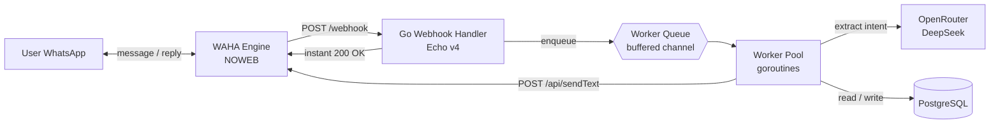
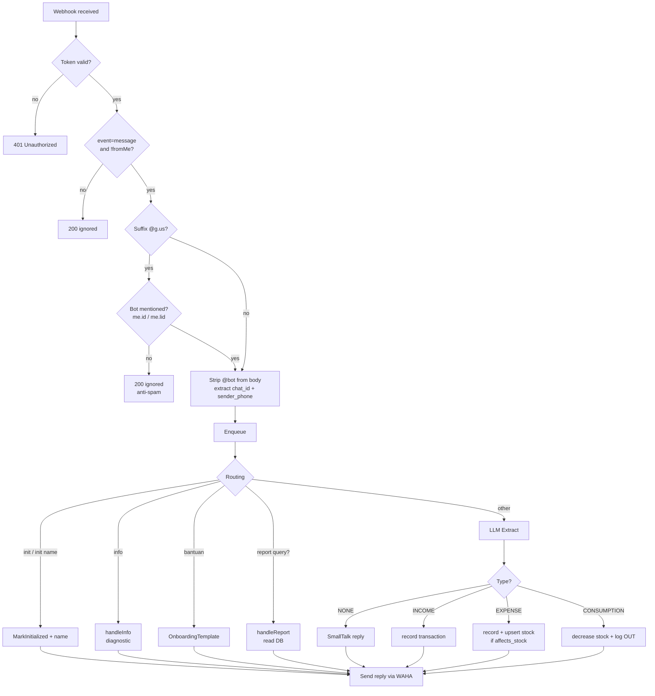

# smart-ledger-agent

A WhatsApp-based assistant for tracking personal expenses and inventory. Just chat naturally — an LLM turns your messages into structured transactions in PostgreSQL.

> Status: Implemented (RFC Rev. C) — see [`RFC/RFC.md`](./RFC/RFC.md) for the full specification.

---

## ✨ Features

- **Chat = Ledger.** Each chat (DM or group) is an independent ledger. Groups share one ledger among members; DMs are personal. The same reporter in 5 groups yields 5 separate ledgers.
- **Natural language.** Type `beli kopi 15rb` ("bought coffee 15k") → automatically classified as `EXPENSE`. No rigid format required.
- **Separate stock vs. cash.** Physical-goods expenses automatically increase inventory; stock consumption automatically decreases it.
- **Opening balance support.** The `SALDO_AWAL` category records the starting cash position, shown separately from income but still counted in net balance.
- **Greeting-aware.** The `NONE` type ensures that `halo` / `pagi` ("hi" / "morning") is never forced into a bogus transaction.
- **Inventory-aware extraction.** Stock consumption messages (`ambil susu 2 pcs`) and repeat purchases automatically resolve item names against the ledger's existing inventory. The LLM receives an inventory snapshot as context — so `susu` matches `susu uht` without exact string comparison. Results are cached in-process with write-through invalidation.
- **Group anti-spam.** The bot only responds when @-mentioned inside a group.
- **Async worker pool.** Webhooks are acknowledged with `200 OK` in < 50ms; heavy processing (LLM, DB) runs in the background with retry/backoff.

---

## 🏛️ Architecture



### Lifecycle of a single message



### Inventory Context & Cache

Before every LLM extraction, the agent loads the chat's current inventory snapshot and injects it into the system prompt. This allows the LLM to resolve ambiguous item names (e.g., `susu` → `susu uht`) against the ledger's actual inventory — avoiding "item not found" errors on stock consumption messages.

| Component | Detail |
| :--- | :--- |
| **Context injection** | Inventory snapshot appended to LLM system prompt (capped at 20 items) |
| **Cache library** | [`patrickmn/go-cache`](https://github.com/patrickmn/go-cache) — in-memory, zero infrastructure |
| **Cache TTL** | 5 minutes with 10-minute cleanup interval |
| **Invalidation** | Write-through — cached entry deleted on every `AddStock` / `DecreaseStock` |

---

## 🗃️ Database Schema

```mermaid
erDiagram
    chats ||--o{ transactions : owns
    chats ||--o{ inventory : owns
    inventory ||--o{ stock_logs : logs

    chats {
        bigint id PK
        varchar(64) chat_id UK
        varchar(128) name "optional label"
        bool initialized
        timestamptz created_at
        timestamptz updated_at
    }
    transactions {
        bigint id PK
        varchar(64) chat_id FK
        varchar(32) sender_phone "audit sender"
        varchar(16) type "INCOME / EXPENSE"
        varchar(32) category
        varchar(128) item_name
        numeric(15,2) amount
        text raw_payload
        timestamptz created_at
    }
    inventory {
        bigint id PK
        varchar(64) chat_id FK
        varchar(128) item_name UK
        numeric(12,2) stock_qty
        varchar(32) unit
        timestamptz updated_at
    }
    stock_logs {
        bigint id PK
        bigint inventory_id FK
        varchar(16) change_type "IN / OUT"
        numeric(12,2) quantity
        text notes
        timestamptz created_at
    }
```

Tables are created automatically via GORM `AutoMigrate` on application start. Adding a new struct field → new column is added automatically (existing columns are not dropped).

---

## 🚀 Quick Start

### Prerequisites

- Go 1.25+
- Docker + Docker Compose
- An OpenRouter account (for the DeepSeek API key)
- An active WhatsApp number (this will become the bot)

### 1. Clone & configure env

```bash
git clone https://github.com/skyapps-id/smart-ledger-agent.git
cd smart-ledger-agent
cp .env.example .env
# Edit .env: set WAHA_API_KEY, WAHA_WEBHOOK_TOKEN, OPENROUTER_API_KEY
```

### 2. Start WAHA + PostgreSQL (via docker compose)

```bash
docker compose up -d            # waha + postgres
make db-up                      # alternative: postgres only
```

Scan the WhatsApp QR at `http://localhost:3000/dashboard` (user `admin`, password = `WAHA_DASHBOARD_PASSWORD`).

### 3. Run the app

```bash
make dev                        # go run ./cmd/server
```

Send messages to the bot number:
```
init project bangunan 1
beli semen 5 sak 250rb
ambil semen 2 sak
info
ringkasan
```

---

## ⚙️ Configuration (`.env`)

| Variable | Required | Default | Description |
| :--- | :---: | :--- | :--- |
| `APP_ENV` | – | `development` | runtime env |
| `APP_PORT` | – | `8080` | HTTP server port |
| `DB_DSN` | – | (localhost pg) | PostgreSQL connection string |
| `WAHA_BASE_URL` | – | `http://localhost:3000` | WAHA base URL |
| `WAHA_SESSION` | – | `default` | WAHA session name |
| `WAHA_API_KEY` | ✓ | – | API key for `POST /api/sendText` |
| `WAHA_WEBHOOK_TOKEN` | ✓ | – | webhook validation token |
| `WAHA_DASHBOARD_PASSWORD` | – | `admin` | WAHA dashboard password |
| `OPENROUTER_BASE_URL` | – | `https://openrouter.ai/api/v1` | – |
| `OPENROUTER_API_KEY` | ✓ | – | OpenRouter API key |
| `OPENROUTER_MODEL` | – | `deepseek/deepseek-chat` | LLM model |
| `WORKER_CONCURRENCY` | – | `4` | number of worker goroutines |
| `WORKER_QUEUE_SIZE` | – | `256` | buffered channel capacity |
| `WORKER_MAX_RETRIES` | – | `3` | max retries for retryable errors |

---

## 💬 Commands

| Message | Action |
| :--- | :--- |
| `init` | Activate the ledger for this chat |
| `init project bangunan 1` | Activate + name the ledger (can be renamed via re-init) |
| `info` | Show session metadata (chat_id, sender, status, name, transaction count) |
| `bantuan` | Show the recording-format guide |
| `saldo awal 5jt` | Record opening cash balance (shown separately from income) |
| `Pengeluaran hari ini berapa?` | Trigger a report (many variants — see `OnboardingTemplate`) |

`info` is available **even before init** — useful for debugging mention/group flows.

---

## 📝 Example Inputs

```
EXPENSES:
> Beli bensin 50rb                          (buy gas 50k)
> Beli susu UHT 1 dus isi 50pcs harga 500rb (auto wholesale conversion)
> Bayar listrik 200rb                       (pay electricity 200k)

INCOME:
> Gaji masuk 10jt                           (salary 10M)
> Saldo awal 5jt                            (opening balance, category SALDO_AWAL)

STOCK CONSUMPTION:
> Ambil susu UHT 2 pcs                      (decrease inventory)

REPORTS:
> Pengeluaran hari ini berapa?              (today's expenses)
> Total pemasukan bulan ini                 (income this month)
> Pengeluaran per item kemarin              (yesterday's expenses per item)
> Barang saya apa aja?                      (current stock)
> Ringkasan kemarin                         (yesterday's summary)
```

---

## 🧱 Project Structure

```
smart-ledger-agent/
├── cmd/server/                 # entrypoint
├── internal/
│   ├── config/                 # env loader
│   ├── database/               # GORM setup + auto-migrate
│   ├── domain/                 # GORM models + constants (Chat, Transaction, Inventory, StockLog)
│   ├── entity/                 # cross-layer business entities (IncomingMessage)
│   ├── handler/
│   │   ├── model/              # webhook parsing DTOs (WahaPayload)
│   │   ├── webhook.go
│   │   └── health.go
│   ├── llm/                    # OpenRouter client + prompt builder
│   ├── repository/
│   │   ├── model/              # query-result DTOs (TxnSummary, ItemBreakdown, StockMovement)
│   │   ├── chat.go
│   │   ├── transaction.go
│   │   ├── inventory.go
│   │   ├── stock_log.go
│   │   └── report.go
│   ├── router/                 # Echo routes
│   ├── service/                # orchestrator (agent.go, report.go, template.go)
│   ├── waha/                   # WhatsApp HTTP client
│   └── worker/                 # async worker pool + retry
├── RFC/RFC.md                  # full specification
├── Dockerfile
├── docker-compose.yml          # postgres + waha + app (optional, via profile)
└── Makefile
```

---

## 🛠️ Development

```bash
make run            # go run ./cmd/server
make build          # build binary to bin/server
make vet            # go vet
make tidy           # go mod tidy
make test           # go test -race -cover
make clean          # remove bin/ and data/

# PostgreSQL helpers (via docker compose)
make db-up          # start postgres
make db-down        # stop postgres
make db-psql        # interactive psql session
make db-reset       # wipe postgres (careful!)
```

---

## 🐳 Deployment

### Local (WAHA + postgres in containers, app on host)

```bash
docker compose up -d            # postgres + waha
make dev                        # app on host (hot reload friendly)
```

### Full container (postgres + waha + app)

```bash
docker compose --profile app up -d --build
```

The `app` profile uses `DB_DSN=host=postgres ...` to connect to the postgres container. WAHA's webhook is configured to `host.docker.internal:8080` (routes to a host-side app) — adjust `WHATSAPP_HOOK_URL` for production when everything runs inside Docker.

---

## 🧰 Tech Stack

| Component | Choice |
| :--- | :--- |
| Language | Go 1.25 |
| HTTP Framework | Echo v4 |
| ORM | GORM |
| Database | PostgreSQL 16 |
| WhatsApp Engine | WAHA (NOWEB) |
| LLM | OpenRouter (DeepSeek Chat) |
| Container | Docker + Docker Compose |
| Logging | `log/slog` (stdlib) |

---

## 📚 Documentation

- **[`RFC/RFC.md`](./RFC/RFC.md)** — full architecture specification (Rev. C), including business rules, LLM JSON contract, and non-functional requirements.

---

## ⚠️ Notes

- **AutoMigrate** only adds new tables/columns — it does not drop or rename. For breaking schema changes (drop/rename), run SQL manually against postgres.
- **Group mention required.** The bot ignores group messages that don't @-mention it (anti-spam). The `@<bot_jid>` token is automatically stripped from the body before processing.
- **Privacy.** The sender's phone number (`sender_phone`) is recorded for audit; restrict its exposure in monitoring logs.
