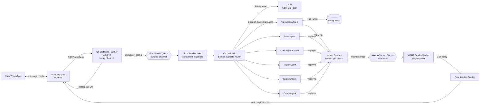
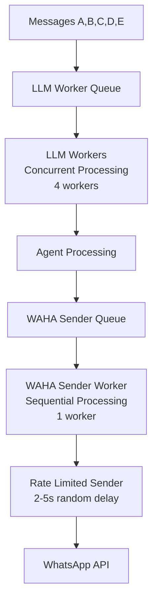
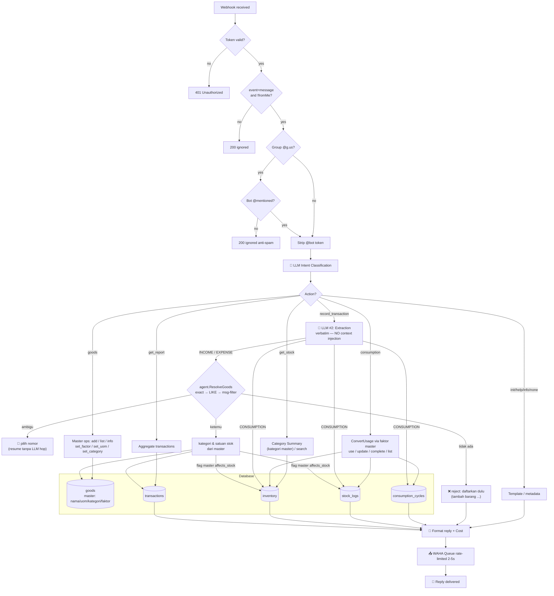

# 🏛️ Architecture

> Back to [README](../README.md) · Full specification: [`RFC/RFC.md`](../RFC/RFC.md)



## Multi-Agent Architecture

Intent classification stays as a single LLM hop in the `Orchestrator` (internal/service/orchestrator), which then dispatches to a specialist `SubAgent` per domain via a dispatch map:

| SubAgent | Actions | System Prompt (skill) | File |
|----------|---------|----------------------|------|
| `transactionAgent` | `record_transaction` | `prompt.go` | internal/service/transaction/ |
| `stockAgent` | `get_stock` | `prompt.go` | internal/service/stock/ |
| `consumptionAgent` | `consumption` | `prompt.go` | internal/service/consumption/ |
| `goodsAgent` | `goods` | `prompt.go` | internal/service/goods/ |
| `reportAgent` | `get_report` | `prompt.go` | internal/service/report/ |
| `systemAgent` | `init`, `help`, `info`, `none` | `prompt.go` | internal/service/system/ |

Every `SubAgent` owns its system prompt (exposed via the `SystemPrompt()` contract) — the LLM transport layer never hardcodes prompts. `Orchestrator` and `transactionAgent` use their prompts on every message; the other agents' prompts are ready for when they get their own LLM calls.

Adding a new domain (e.g., budgeting, reminders) means implementing the `SubAgent` interface and appending it to the agent list in `cmd/server/main.go` — the orchestrator is domain-agnostic (it only receives `[]agent.SubAgent`), so no changes to routing and no extra LLM calls.

## 🧭 Task Tracing (End-to-End Observability)

One message = one task. The Task ID is generated by the webhook handler, returned in the `X-Task-ID` response header, carried inside `entity.IncomingMessage`, and propagated through `context` to every sub-agent:

| Stage | What happens |
|-------|--------------|
| Webhook (`handler/webhook.go`) | generates Task ID, tags all HTTP logs, sets `X-Task-ID` header |
| Worker pool (`worker/pool.go`) | drop/retry/failure logs carry `task=...` |
| Orchestrator | wraps ctx with `agent.Task`, records `llm.classify_intent` + `handle` steps, prints `task selesai` summary |
| Sub-agents | record their own steps (`llm.extract`, `persist`) with cost + duration |
| Reply helper | every reply enqueue is recorded as a `reply` step |

Every step is logged in real time (`task step`) and summarized at the end:

```
INFO task step    task=7198c2abaeb89f39 step=1 agent=orchestrator action=llm.classify_intent detail=record_transaction cost_usd=7.0085e-05 took=3.75s
INFO task step    task=7198c2abaeb89f39 step=2 agent=transaction action=llm.extract detail=EXPENSE cost_usd=0.000538 took=19.1s
INFO task selesai task=7198c2abaeb89f39 steps=5 cost_total=0.00060861 durasi=22.9s
                  trace="orchestrator/llm.classify_intent(record_transaction) -> transaction/llm.extract(EXPENSE) -> transaction/persist(EXPENSE) -> reply/enqueue(...) -> *transaction.transactionAgent/handle(record_transaction)"
```

Follow any message end-to-end with one grep:

```bash
docker logs -f <container> 2>&1 | grep 7198c2abaeb89f39
```

## Two-Tier Worker Architecture

The system uses a two-tier worker architecture to optimize performance and prevent WhatsApp bans:



**Tier 1: LLM Workers (Concurrent)**
- 4 parallel workers for fast LLM processing
- Handles intent classification, parameter extraction
- Processes database operations concurrently
- Queues replies for WhatsApp sending

**Tier 2: WAHA Sender (Sequential)**
- Single worker processes messages one-by-one
- Random 2-5 second delays between sends
- Prevents WhatsApp anti-spam detection
- Human-like message timing

## Lifecycle of a Message



## Master-First Name Resolution (no context injection)

The LLM never receives a catalog — extraction prompts are constant-size, and item names are matched **after** extraction via indexed DB queries (`agent.ResolveGoods`):

```
"beli susu bmt"  →  exact match (case-insensitive)  →  hit ✅
                 →  LIKE '%susu bmt%' (max 5)        →  1 result → use it
                 →  several candidates              →  filter by original message
                 →  still ambiguous                  →  🔢 numbered choice ("1"/"2" resumes without an LLM hop)
                 →  nothing                          →  ❌ reject: "daftarkan dulu: tambah barang X satuan [u]"
```

| Property | Detail |
| :--- | :--- |
| **Prompt tokens** | Constant — the extraction prompt never grows with the catalog |
| **Matching** | `LOWER(...) LIKE` on `goods.name` (index-backed, per chat) |
| **Ambiguity** | Numbered confirmation via `PendingConfirms` (TTL 5m) on buy/use/goods paths |
| **Unknown items** | Rejected with guidance — no auto-create, no hallucinated names |
| **Cache** | None needed — one indexed query per resolution |

## 🚀 Token Optimization Strategy

The system implements multiple optimization strategies to minimize LLM token usage and operational costs:

### 1. Zero Context Injection
Extraction prompts contain no catalog snapshot at all — the LLM copies item names verbatim from the message, and matching happens afterwards via indexed DB queries (`ResolveGoods`). Prompt size is **constant** regardless of how many items the chat has registered.

### 2. Lean Prompts
The transaction prompt carries no unit-conversion rules (master owns conversions), no consumption-analysis fields, no affects_stock rules (the master's stock flag decides), and only 9 compact examples. The LLM never performs unit math.

### 3. Category-Based Summarization (WhatsApp Display Optimization)
For general stock queries, the system provides category summaries instead of raw item lists:

```go
// Query: "stok"
// Before: List 20 items (~1500 tokens)
// After: Category summary (~200 tokens)

📦 Stok per Kategori:
• MINUMAN: 4 item (contoh: susu uht 500ml)
• SEMBAKO: 4 item (contoh: beras 5kg)
• LAINNYA: 2 item (contoh: tissue)
```

**Benefits:**
- 80-90% token savings for WhatsApp replies
- Better user experience (overview → drill down)
- Handles large inventories gracefully

### 4. Smart Fallback Logic
The system automatically detects query patterns and applies optimal strategies:

| Query Pattern | Strategy | Result |
|---------------|----------|--------|
| `"stok kecap"` | LIKE search on goods/inventory (1-5) | Specific results |
| `"stok"` | Category summary from `goods.category` | Compact overview |
| `"stok galon"` (registered, never bought) | Master lookup | "0 galon (terdaftar, belum pernah dibeli)" |
| `"stok kecap"` (not registered) | Master lookup | Reject + `tambah barang` guidance |

### 5. Real-Time Cost Tracking
Every operation includes transparent cost reporting:

```go
// Every WhatsApp reply includes:
💰 AI cost: $0.000156

// Cost breakdown logged:
- Intent classification: $0.0001
- Extraction (search optimized): $0.000056
- Total: $0.000156
```

See [LLM & Cost](./LLM.md) for pricing details.

## 🤖 LLM-Based Routing Architecture

The system uses LLM as a **translator/adapter** from natural language to structured service API calls.

### Transaction Types

| Type | Description |
|------|-------------|
| `INCOME` | Money in (salary, bonus, transfer received) |
| `EXPENSE` | Buying goods/services (money out) |
| `CONSUMPTION` | Using stock items, no money involved |
| `NONE` | Not a transaction (greeting, chitchat) |

### Intent Routing Priority

The intent classifier evaluates messages top-down and stops at the first match:

| Priority | Keyword / Pattern | Action | Examples |
|----------|-------------------|--------|----------|
| 1 | `pakai` / `dipakai` / `ambil` | `consumption` (use) | `"pakai beras 1 kg"` |
| 2 | `terpakai` | `consumption` (update, needs batch) | `"terpakai susu (AUG-12-152714) 100ml"` |
| 3 | `habis` | `consumption` (complete) | `"susu uht 500ml sudah habis"` |
| 4 | `konsumsi` / `pemakaian` / `barang aktif` | `consumption` (info / list / history) | `"konsumsi susu"` |
| 5 | `init` / `bantuan` / `info` | `init` / `help` / `info` | `"init dompetku"` |
| 6 | `beli` / `bayar` / `jual` / money amount | `record_transaction` | `"beli kopi 15rb"` |
| 7 | `master barang` / `tambah barang` / `set ...` | `goods` | `"set 1 galon 15lt"`, `"tambah barang beras satuan kg"`, `"set stok gas ya"` |
| 8 | `stok` / `sisa` / `persediaan` | `get_stock` | `"stok kecap"` |
| 9 | `pengeluaran` / `pemasukan` / `laporan` | `get_report` | `"ringkasan kemarin"` |
| 10 | No match | `none` | `"halo"`, chitchat |

**Disambiguation examples:**
- `"beli stok kecap 50rb"` → `record_transaction` (`beli` + money wins over `stok`)
- `"master barang"` → `goods` (not `get_stock`, even though both mention "barang")
- `"harga beli terakhir susu"` → `get_stock` (`harga` beats `beli`)

### Implementation Details

**1. Intent Classification Prompt (`intentSystemPrompt`)**
- Lives in `internal/service/orchestrator/prompt.go` — owned by the orchestrator, not the transport layer
- Classifies user messages into actions: `init`, `help`, `info`, `goods`, `get_stock`, `get_report`, `consumption`, `record_transaction`, `none`
- Extracts structured parameters (e.g., `item_filter: "kecap"`, `consumption_action: "info"`)
- Handles typo tolerance and natural language variations
- Today's date is appended at runtime (`llm.TimeContext`) so relative dates and short dates ("11/08") resolve correctly

**2. Transaction Extraction Prompt (`transactionSystemPrompt`)**
- Lives in `internal/service/transaction/prompt.go` — the only other prompt actually sent to the LLM (2nd hop)
- GROSIR vs KEMASAN naming, amount formats (`50rb`/`1.5jt`), dates — and NO unit-conversion or affects_stock rules: names and units are copied verbatim, the master owns all conversions and the stock flag

**3. Service Handlers (per-domain agents)**
- `handleInitAction()` - Ledger initialization (system)
- `handleGetStock()` - Stock queries, master-aware fallback (stock)
- `handleGetReport()` - Financial reports & analysis (report)
- `handleConsumptionAction()` - Consumption cycles via master factors (consumption)
- `handleRecordTransaction()` - Master-first transaction recording (transaction)
- `handleGoodsAction()` - Master CRUD: add / list / info / set_factor / set_uom / set_category (goods)

**4. Extensibility**
Adding a new domain requires:
1. New package `internal/service/<domain>/` implementing `agent.SubAgent` (Actions, SystemPrompt, Handle) + its `prompt.go`
2. One line in `cmd/server/main.go`: append `<domain>.NewAgent(...)` to the agents slice
3. Optionally teach the intent classifier the new action in `internal/service/orchestrator/prompt.go`

The orchestrator, worker, and routing code stay untouched.

```go
// cmd/server/main.go
agents := []agent.SubAgent{
    transaction.NewAgent(...),
    stock.NewAgent(...),
    // domain baru cukup di-append di sini:
    budgeting.NewAgent(...),
}
orch := orchestrator.New(agents, chatRepo, intentExtractor, replySender, logger)
```
